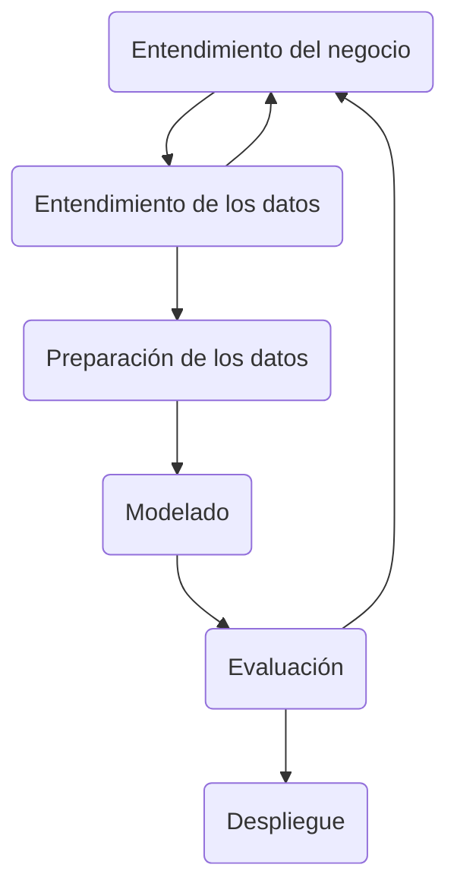

# Caso de Negocio: Detección temprana y preventiva de Diabetes tipo II

Al año 2022, de acuerdo con el Minsa, un 98% de los casos de diabetes diagnosticados en el Perú corresponden a Diabetes tipo II, la cual se desarrolla lentamente con el tiempo. Esto subraya la necesidad de disponer de tratamientos preventivos para evitar la evolución de la enfermedad.

>Por ello, el objetivo es elaborar un modelo de Machine Learning que pueda **clasificar** a las personas de acuerdo al riesgo de padecer Diabetes tipo II en base a datos clínicos, biomédicos y/o ambientales disponibles y **recomendar** tratamientos preventivos de acuerdo a la clasificación. Con esto, se reduciría la carga económica y emocional que conlleva el desarrollo de esta enfermedad sobre los individuos y la sociedad.  

## Metodología para el caso de negocio

Para el presente proyecto se plantea el uso de la **metodología CRISP-DM**, considerada como la metodología base para proyectos dedicados a extraer valor de los datos, como también el modelo analítico más usado para ese fin.  

