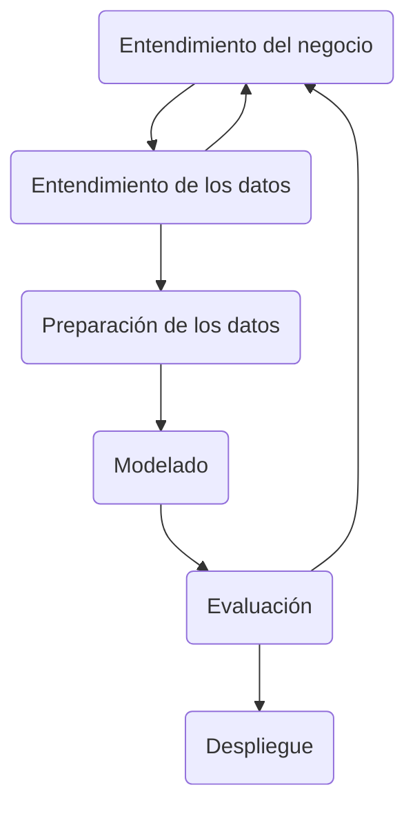

# Caso de Negocio: Detección temprana y preventiva de Diabetes tipo II

Al año 2022, de acuerdo con el Minsa, un 98% de los casos de diabetes diagnosticados en el Perú corresponden a Diabetes tipo II, la cual se desarrolla lentamente con el tiempo. Esto subraya la necesidad de disponer de tratamientos preventivos para evitar la evolución de la enfermedad.

>Por ello, el objetivo es elaborar un modelo de Machine Learning que pueda **clasificar** a las personas de acuerdo al riesgo de padecer Diabetes tipo II en base a datos clínicos, biomédicos y/o ambientales disponibles y **recomendar** tratamientos preventivos de acuerdo a la clasificación. Con esto, se reduciría la carga económica y emocional que conlleva el desarrollo de esta enfermedad sobre los individuos y la sociedad.

## Metodología para el caso de negocio

Para el presente proyecto se plantea el uso de la **metodología CRISP-DM**, considerada como la metodología base para proyectos dedicados a extraer valor de los datos, como también el modelo analítico más usado para ese fin.

### 1. Entendimiento del negocio

Se encuentra la situación problemática respecto a la prevención, diagnóstico y tratamiento oportuno de la diabetes y sus consecuencias asociadas.

### 2. Entendimiento de los datos

Para entrenar y evaluar el modelo, se requiere un entendimiento de la realidad a estudiar. Se inicia la recolección de un conjunto de datos que contenga:

*   Variables de entrada (predictores):
--   Edad
--   Índice de masa corporal (IMC)
--   Nivel de glucosa en sangre (glucosa en ayunas)
--   Presión arterial sistólica y diastólica
--   Historial familiar de diabetes
--   Nivel de actividad física
--   Otros biomarcadores relevantes (por ejemplo, colesterol, triglicéridos)
--   Variables alimenticias

*   Variable de salida (objetivo):
--   Clasificación: Pacientes en riesgo de diabetes mellitus
--  Opción de tratamiento oportuno

_
### 3. Preparación de datos

Antes de construir el modelo, es crucial realizar las siguientes tareas:

<table>
  <tr>
    <th>Limpieza de datos</th>
    <td>Tratar valores faltantes, outliers y datos inconsistentes.</td>
  </tr>
  <tr>
    <th>Normalización/escalamiento</th>
    <td>Asegurarse de que todas las variables tengan una escala comparable.</td>
  </tr>
    <tr>
    <th>Partición de datos</th>
    <td>Separar los datos en conjuntos de entrenamiento y prueba para evaluar el rendimiento del modelo
    </td>
  </tr>
</table>
_

### 4. Selección y Construcción del Modelo

Para este paso, los modelos adecuados incluyen:
*  Regresión logística 
*  Árboles de decisión
* Máquinas de vectores de soporte (SVM)
* Redes neuronales artificiales

_
    

### 5. Entrenamiento y Evaluación del Modelo
<table>
  <tr>
    <th>Entrenamiento del modelo</th>
    <td>Utilizando el conjunto de entrenamiento.</td>
  </tr>
  <tr>
    <th>Validación cruzada</th>
    <td>Para ajustar los parámetros del modelo y evitar sobreajuste.</td>
  </tr>
    <tr>
    <th>Evaluación del rendimiento</th>
    <td>Utilizando métricas (por definir)
</td>
  </tr>
</table>
_

### 6. Implementación, despliegue y monitoreo

Una vez entrenado y evaluado el modelo, se puede implementar en un entorno controlado donde será usado para predecir el riesgo de diabetes tipo II en nuevos pacientes. Es importante monitorear el rendimiento del modelo y actualizarlo según sea necesario con nuevos datos, permitiendo la retroalimentación y mejora continua.
_

### 7. Consideraciones adicionales

<table>
  <tr>
    <th>Privacidad de los datos</th>
    <td>Los datos deben ser anónimos y cumplir con las regulaciones de protección de datos según ley vigente</td>
  </tr>
  <tr>
    <th>Equidad del modelo</th>
    <td>Se debe evitar los sesgos y asegurar que el modelo funcione para diversos grupos demográficos como sea posible</td>
  </tr>
</table>
_
